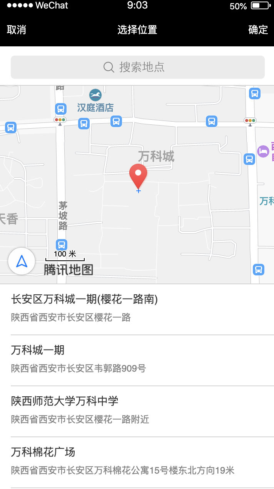
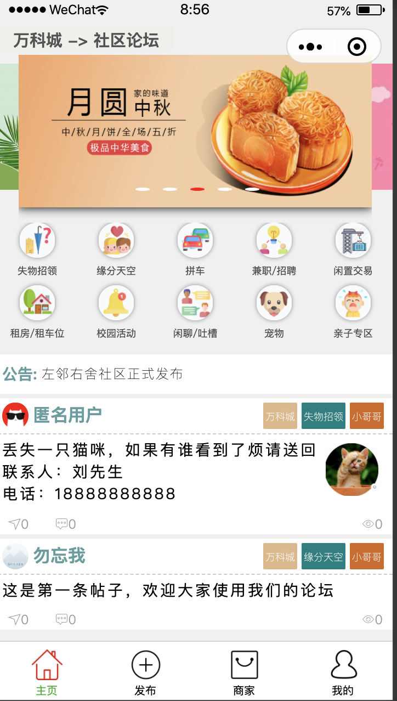
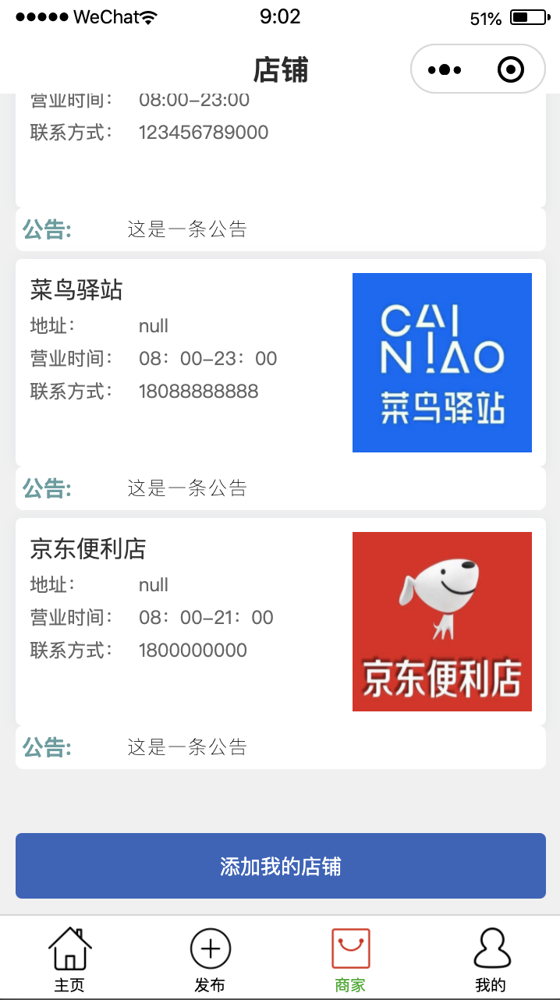
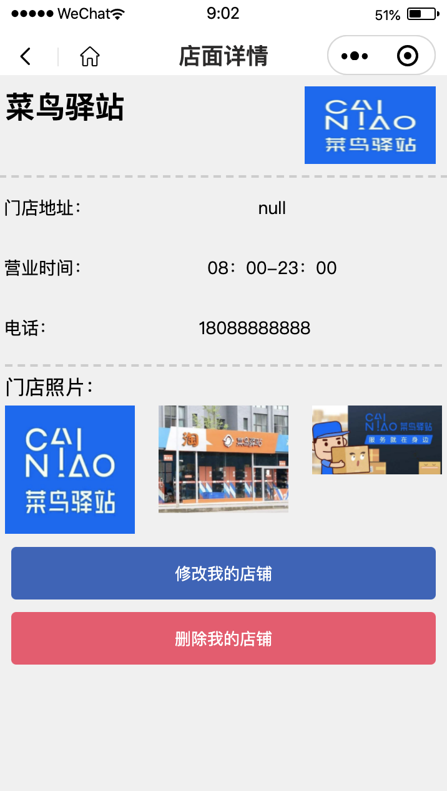
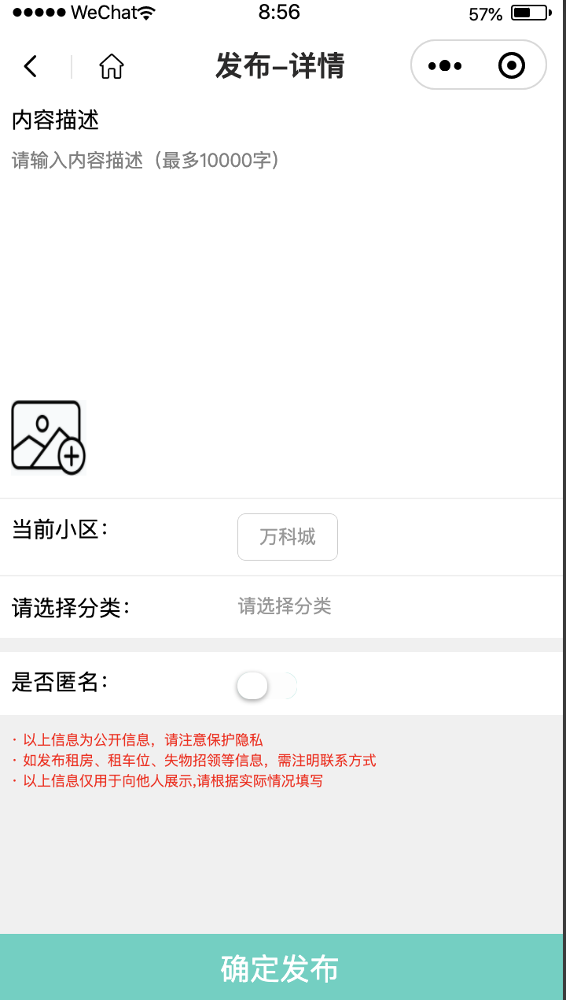
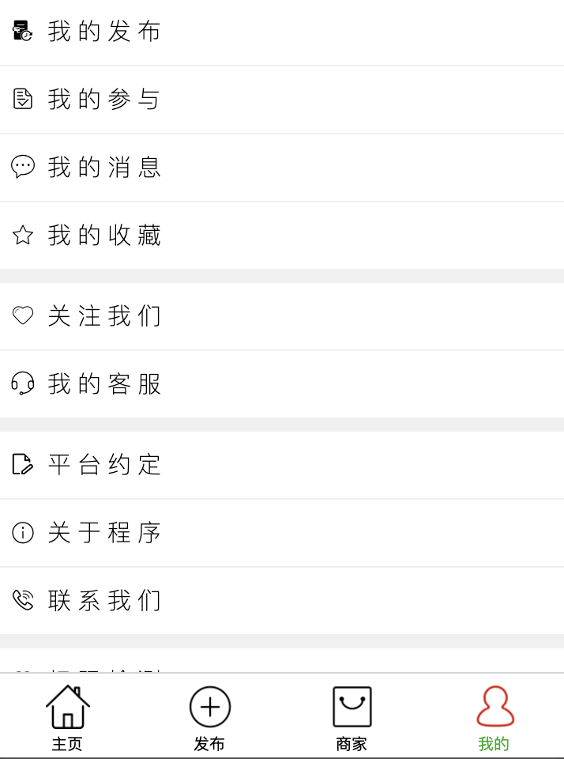

# 本项目基于开源项目[Mango](https://github.com/Xin-Felix/Mango)二次开发，如有问题可以随时联系我，微信号：ldpliu
### 实现了小区/学校位置选择，并根据小区/学校展示信息。信息包括小区信息交流共享，学校信息交流共享，社区论坛，租车，租房，宠物专区，表白，缘分，类似58的平台。可创建，删除，展示小区的商铺信息。

# 先上是项目的截图

# 如果项目帮助到了你，烦请给个辛苦钱

### 项目使用技术
 1.前台微信小程序(Vue)
 2.后台(springBoot+mybatis+mysql)
 
### 如何使用
## 工具(IDEA(maven),tomcat,mysql(5.6以上)使用maven下载依赖以后方可启动,默认使用外置tomcat,不懂设置就默认启动就行)

 1.打开前台代码先修改app.js去配置服务器地址和oss的地址(用于展示图片)
 
 2.打开前台util/config.js配置阿里云oss(如果有自己需求可以直接在后台增加上传的代码)
 
 3.后台就不多说了,创建sql表,去修改yml文件内容
 
 4.数据库请提前储存部分信息(sql文件带测试数据,进入程序自己可以添加数据),不然无法正常进入小程序
 
 5.因为微信小程序登录需要用到appid和密钥,登陆微信公众平台查看小程序的appid和密钥,然后找到后台源码Controller层的LoginController.java修改你的appid和密钥
 
 6.去后台源码/backend/src/main/java/work/huangxin/mango/util/isDelete/IsDelete.java添加你自己的oss信息(删除oss的文件的操作)
 
 7.数据库是mysql,版本需要大于5.5,否则会有冲突无法导入sql文件
 
 8.[oss购买地址,几块钱](https://www.aliyun.com/minisite/goods?userCode=ztot6i1n),创建bucket,请将bucket默认权限改为公共读写,否则外界无法访问
 
### 程序本身的一些功能
 1.发布帖子

 2.收藏

 3.转发
 
 4.帖子的增删改查
 
 5.最新消息的提醒
 
 5.管理员可以前台管理帖子
 
 6.匿名发布,封禁用户
 
 7.消息提醒等

 8.管理员以及禁用的功能(数据库表mango_user中的user_is_admin为2是管理员,user_allow为1正常使用,其他数字禁止用户使用程序功能)
 
 9. 用户小区选择，根据位置展示发帖

 10. 创建商铺信息

 11. 根据位置展示商铺信息
 [管理员可以修改用户的帖子以及删除,在帖子页面,点击头像可以查看用户的信息并可以禁用Ta,可以回复消息给Ta]

